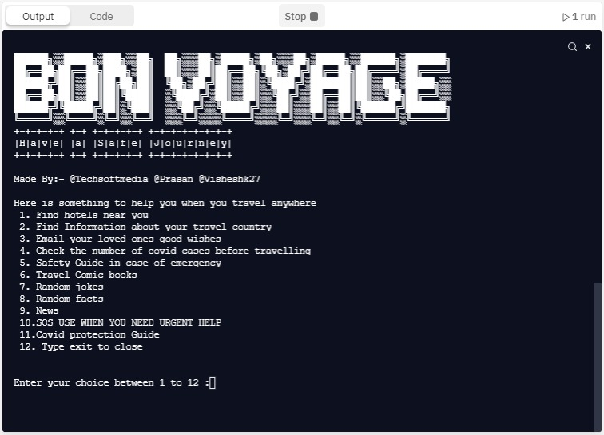

# Ultimate-Trip-Guide
  
Inspiration
The past two years have been life-changing for almost everyone; the thing that inspired us the most is the urge to travel to different parts of the world and witness the breath-holding scenes worldwide.

What it does
It is a perfect match for a travel partner, as it has 10+ options with various options like finding the nearest hotel, finding information about the country you are traveling to, Email services for connecting with your loved ones when you are in a different part of the world, Importantly checking the number of active covid cases, Safety Guides in case of emergency, comic books for passing the time during the travel period, Random jokes facts along with latest local news updates, SOS emergency service for your protection and emergency, another important guide that is Covid-19 safety guidelines.

How we built it
It is mainly built with python and replit; along with this, the libraries used are hotel, corona, SMTP, places, newsfetch.news, pyfiglet, pyjokes, random, py8fact.

Challenges we ran into
We ran into the covid cases visualization process as firstly we thought to make the data more engaging by adding various graphs related to covid and other than this we also tried to make an option for connecting with various local clubs like learning language and other traditions of the place an individual is visiting.

Accomplishments that we're proud of
We started with just one aim to make traveling convenient as much as possible, and astonishingly we ended up adding many great features, possibly making almost all the things available.

What we learned
We learned a lot of new things, like we were not much comfortable with replit but working on this project. We became good with integrity and data visualization on a large scale and SMTP services that can be made possible with python.

What's next for ULTIMATE TRAVEL BUDDY
For now, we have focused on the back-end part by adding more options and integrity. Next, we aim to improve the UI for this project and to make it more user interactive.

Please see all attached photos for understanding all the features easily.
TRY OUT LINK AND CODE HERE :- https://replit.com/@BONVOYAGE/hackathon
